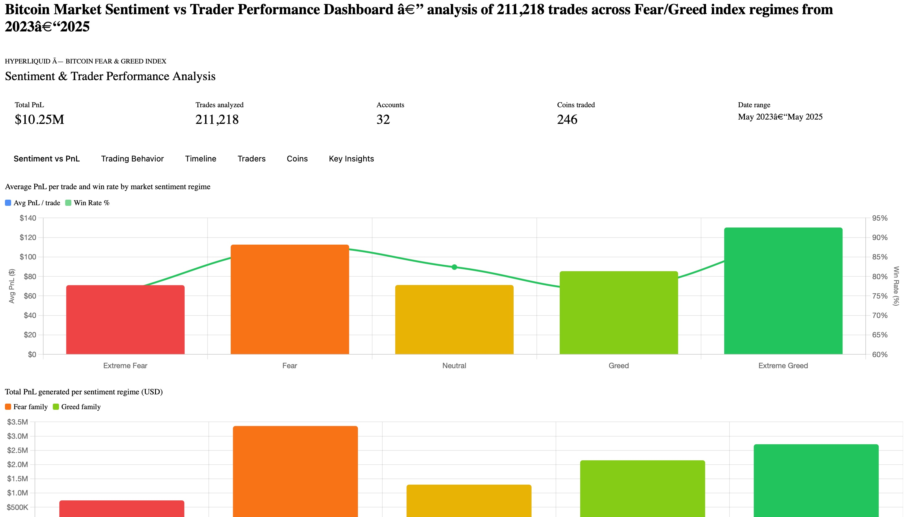
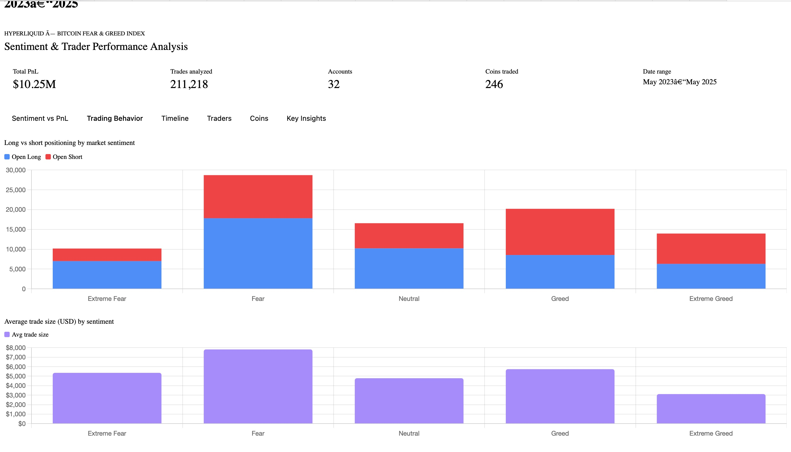
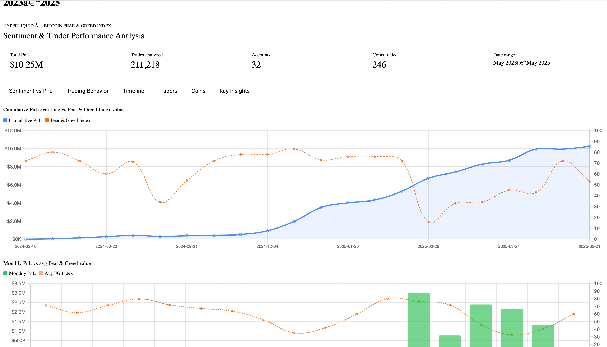
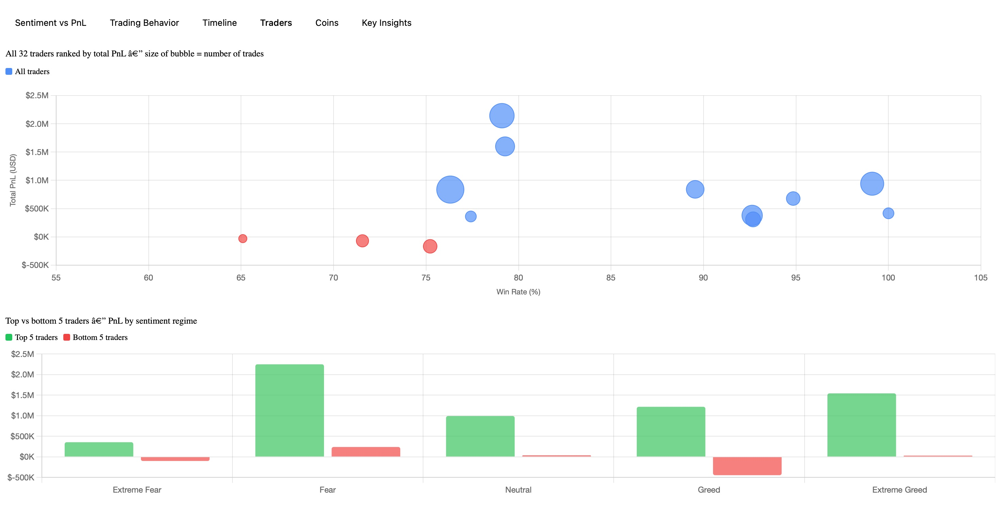
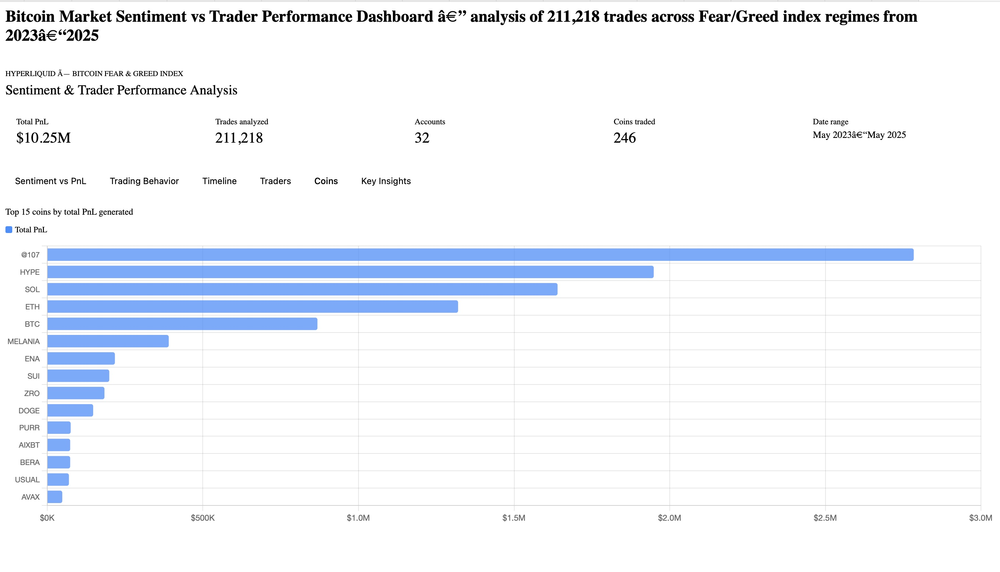

# Bitcoin Sentiment × Hyperliquid Trader Analysis

> Exploring the relationship between Bitcoin's Fear & Greed Index and real trader performance on Hyperliquid — uncovering how market sentiment shapes trading outcomes across 211,000+ trades.

---

## Overview

This project merges two datasets to answer a core question: **does market sentiment predict how well traders perform?**

The analysis spans **May 2023 – May 2025**, covering 32 traders, 246 coins, and $10.25M in total closed PnL — all mapped against daily Bitcoin Fear & Greed Index readings.

---

## Datasets

| File | Description |
|------|-------------|
| `historical_data.csv` | Hyperliquid trade history — 211,224 rows with account, coin, execution price, size, direction, PnL, fees, timestamps |
| `fear_greed_index.csv` | Daily Bitcoin Fear & Greed Index — date, numeric value (0–100), and classification label |

### Fear & Greed Classifications
| Label | Index Range |
|-------|------------|
| Extreme Fear | 0–24 |
| Fear | 25–44 |
| Neutral | 45–55 |
| Greed | 56–75 |
| Extreme Greed | 76–100 |

---

## Key Findings

### 1. Extreme Greed = Best Performance
Traders achieved their **highest avg PnL ($130/trade) and win rate (89%)** during Extreme Greed — when crowd euphoria is at its peak.

### 2. Fear is Underrated
The **Fear regime produced $113 avg PnL and 87% win rate** — second only to Extreme Greed. Traders who stay active during fearful markets capture disproportionate returns.

### 3. Neutral Markets Are the Hardest
Sideways, indecisive markets (Neutral) tied with Extreme Fear for the **lowest avg PnL ($71/trade)**. Range-bound conditions squeeze profitability.

### 4. Contrarian Positioning Pattern
| Sentiment | Long % | Short % |
|-----------|--------|---------|
| Extreme Fear | 68.8% | 31.2% |
| Fear | 62.1% | 37.9% |
| Neutral | 61.7% | 38.3% |
| Greed | 42.3% | 57.7% |
| Extreme Greed | 45.1% | 54.9% |

Traders **buy in fear and short in greed** — a profitable contrarian stance.

### 5. Trade Size Follows Opportunity
Average trade size in Fear (**$7,816**) is 2.5× larger than in Extreme Greed (**$3,112**) — traders commit more capital when they sense a real opportunity.

### 6. Top vs Bottom Trader Divergence
- **Top 5 traders are positive in every sentiment regime** — they adapt direction rather than always going one way
- **Bottom traders lose most in Extreme Fear (−$100K) and Greed (−$446K)** — they panic-sell crashes and chase tops in rallies
- **Win rate ≠ profitability**: one account had 99.12% win rate but earned less than the top account with 79% win rate — position sizing matters more

### 7. Concentration of Alpha
- Top 2 coins (**@107** and **HYPE**) generated **$4.73M (46%)** of total profits
- **$8.4M of $10.25M total PnL** was made in just 5 months (Dec 2024 – Apr 2025)

---

## Results Summary

| Sentiment | Total PnL | Avg PnL/Trade | Win Rate | Trades |
|-----------|-----------|---------------|----------|--------|
| Extreme Fear | $739,110 | $71.03 | 76.2% | 10,406 |
| Fear | $3,357,155 | $112.63 | 87.3% | 29,808 |
| Neutral | $1,292,921 | $71.20 | 82.4% | 18,159 |
| Greed | $2,150,129 | $85.40 | 76.9% | 25,176 |
| Extreme Greed | $2,715,171 | $130.21 | 89.2% | 20,853 |

---

## Project Structure

```
├── README.md
├── historical_data.csv        # Raw Hyperliquid trade data
├── fear_greed_index.csv       # Daily Bitcoin Fear & Greed Index
├── analysis.py                # Full analysis pipeline (Python/pandas)
└── analysis.json              # Pre-computed output data (used by dashboard)
```

---

## Running the Analysis

### Requirements
```bash
pip install pandas numpy
```

### Run
```bash
python analysis.py
```

Outputs a summary to stdout and saves `analysis_output.json` with all computed metrics.

---

## Dashboard Screenshots

### Sentiment vs PnL


### Trading Behavior — Long/Short Positioning & Trade Size


### Timeline — Cumulative PnL vs Fear & Greed Index


### Traders — Bubble Chart & Top vs Bottom Comparison


### Top 15 Coins by PnL


---

## Tools Used

- **Python** — pandas, numpy for data processing
- **Data source 1** — [Alternative.me Fear & Greed Index](https://alternative.me/crypto/fear-and-greed-index/)
- **Data source 2** — Hyperliquid perpetuals trading data

---

## Insights for Trading Strategy

1. **Stay active in Fear** — win rates and avg PnL are near their peak; most traders sit out and miss the move
2. **Go contrarian at extremes** — buy Extreme Fear, consider shorts in Extreme Greed
3. **Size up in Fear, size down in Greed** — the data shows the best traders naturally do this
4. **Win rate is a vanity metric** — focus on expectancy (avg PnL × win rate) and position sizing
5. **Watch for sentiment regime shifts** — the biggest PnL days cluster around transitions between regimes
